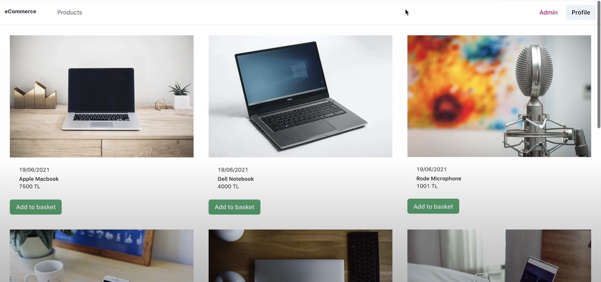

# Backend Ayağa Kaldırma

1. Mongodb ve Redis'i yükleyebilmek için backend içerisindeki docker-compose dosyası çalıştırılmalıdır. ( Bilgisayarınızda docker ve compose yüklü olmalıdır. [Docker indirmek ve bilgi almak için tıklayın](https://docs.docker.com/get-started/get-docker/) Bunun için backend dizinine gidilerek docker-compose up komutu çalıştırışlır.

2. `cd backend`

3. `docker-compose up -d`

4. backend dizininde .env dosyası oluşturulur ve içerisine gerekli bilgiler girilir. (MONGO_URI=mongodb://localhost:27017 , JWT_SECRET: ,  JWT_REFRESH_SECRET: )

5. JWT_SECRET: ,  JWT_REFRESH_SECRET oluşturmak için backend dosyası içindeki generateSecretKey.js dosyası kullanılabilir. (Konsola node generateSecretKey yazmak yeterlidir.)

6. Mongo DB Compass uygulmasından yeni bir Database oluşturulur.

7. mongodb://localhost:27017 adresine bağlantı kurulur.

8. Bu işlemin ardından "Add Data -> Import File" diyerek backend dizininde yer alan assets klasöründeki json dosyalarını ilgili collectionlara eklenir.

9. backend dizininde yarn dev komutu çalıştırarak backend ayağa kaldırılır.

# E-commerce-App

